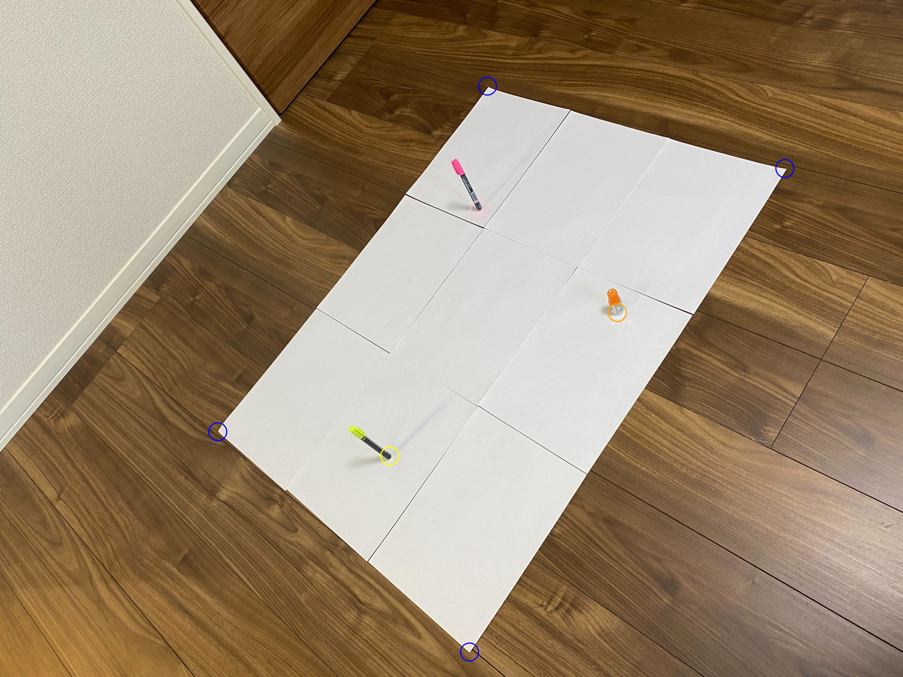
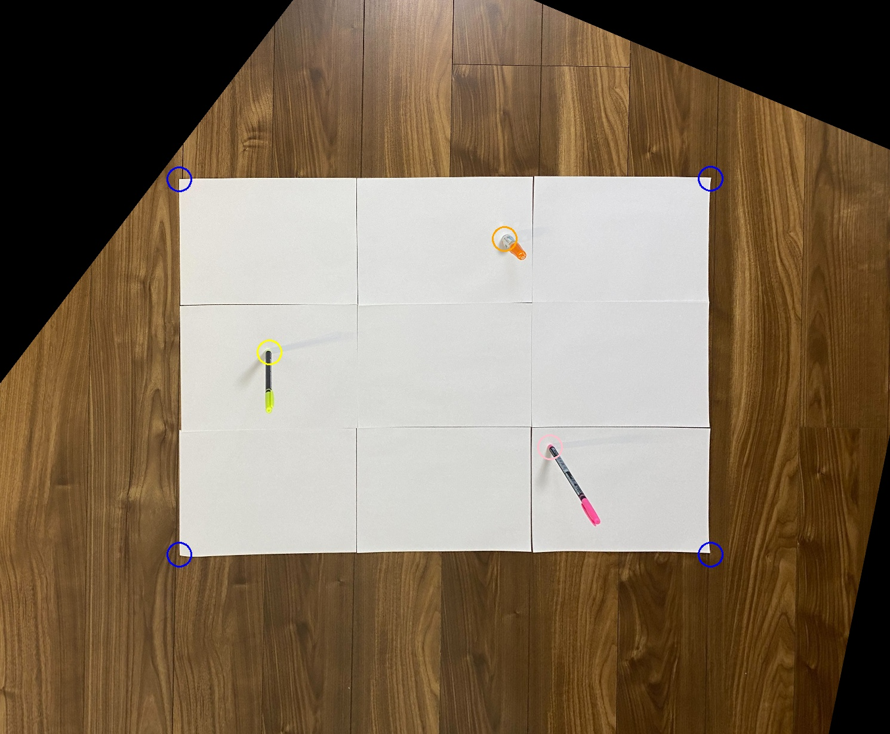

# Homography 変換のお試しコード

## 環境構築
```
pip install -r requirements.txt
```

## データ準備
本コードは以下のような画像データと json データを前提に構築されている
それぞれのファイル名は一致させ、input directory 以下に格納する
### 画像データ ( 01.jpg )

### 画像に対応する json データ ( 01.json )
```
{
    "paper": {
        "lower_left": {
            "x": 2096,
            "y": 2912
        },
        "lower_right": {
            "x": 3504,
            "y": 752
        },
        "upper_right": {
            "x": 2176,
            "y": 384
        },
        "upper_left": {
            "x": 972,
            "y": 1928
        }
    },
    "yellow_pen": {
        "x": 1740,
        "y": 2036
    },
    "pink_pen": {
        "x": 2140,
        "y": 936
    },
    "orange_pen": {
        "x": 2756,
        "y": 1396
    }
}
```
- paper とは画像上の紙のエリアを指し、頂点の 4 の内、一番下のポイントを lower_left とし、反時計回りに、lower_right, upper_right, upper_left とていぎ
- yellow_pen、pink_pen、orange_pen は黄色、ピンク、オレンジのペンをさす
    - orange_pen は厳密には目薬だがご愛嬌！

## 実行
入力画像を鳥瞰図に変更する homography 変換を実行する
```
python transform.py
```
実行後 output directory 下に

- src_img_01.jpg
- dst_img_01.jpg

が出力される。
### src_img_01.jpg
入力画像に json データを重畳すると以下のようになる

- 入力画像と json データの位置関係が合っているか確認できる

- 鳥瞰画像が出力される